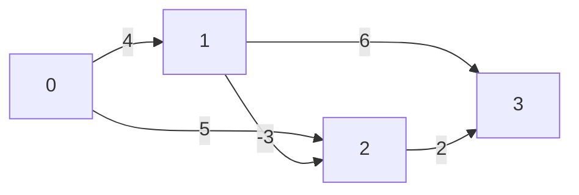

# 深入浅出最短路径：Bellman–Ford、SPFA 与 Dijkstra 算法详解（C++ 实现）

## 1. 引言
在计算机科学中，图论是最重要的数学工具之一，而**最短路径问题** 则贯穿了网络路由、地图导航、社交网络分析、物流规划等无数实际场景。给定一个带权有向图和一个源点，单源最短路径问题要求找出从源点到其余所有顶点的最短路径长度。然而，边权可正可负，图中可能含有环，甚至可能出现总权重为负的环路，这些因素对算法的选择和设计产生巨大影响。

本文将深入剖析三种经典的单源最短路径算法：**Dijkstra**、**Bellman–Ford** 以及 **SPFA (Shortest Path Faster Algorithm)**。我们将从核心思想、算法流程、正确性、复杂度、适用场景和 C++ 实现等方面逐一展开，所有代码均配有极其详细的注释，帮助读者真正理解每一行逻辑。此外，我们还会横向对比三者的优缺点，总结在不同条件下该如何选择。

阅读完这篇博客，你将能够：
- 理解松弛操作的物理意义；
- 手写堆优化的 Dijkstra 并清楚为何它惧怕负权边；
- 用 Bellman–Ford 处理带负权的图并检测负环；
- 写出高性能的 SPFA，并明白它何时可能退化；
- 根据图的规模、权值特征对算法做出正确选择。

## 2. 问题定义与图的基本存储
设图 \( G = (V, E) \) 是一个带权有向图，顶点编号为 \( 0 \) 到 \( n-1 \)。对于每条有向边 \( (u, v) \)，有一个整数权重 \( w \)。给定源点 \( s \)，要求计算从 \( s \) 到所有顶点 \( v \) 的最短距离 \( dist[v] \)。若不可达，则距离为无穷大；若存在负权环使得路径可以无限减小，则需要检测并报告。

在代码实现中，我们采用**邻接表** 存储图，它既能应对稀疏图，又有良好的空间局部性。边的信息用结构体表示，包含目标顶点和权重。对于 Bellman–Ford，我们额外保存一份边列表，方便遍历。

以下是后续所有算法都会用到的公共定义和常量：

```cpp
#include <iostream>
#include <vector>
#include <queue>
#include <cstring>
#include <algorithm>
using namespace std;

const int INF = 0x3f3f3f3f;       // 定义无穷大，方便用 memset 初始化
const int MAXN = 100005;          // 最大顶点数，根据需要调整

// 边结构体
struct Edge {
    int to;      // 目标顶点
    int weight;  // 边的权重
    Edge(int t, int w) : to(t), weight(w) {}
};

// 图：邻接表
vector<Edge> adj[MAXN];           // adj[u] 存放从 u 出发的所有边
vector<tuple<int,int,int>> edges; // 边列表，用于 Bellman–Ford（存储 u, v, w）

int n, m;                         // n 为顶点数，m 为边数
```

若图是无向的，只需在添加边时插入两条有向边即可。

## 3. 松弛操作——所有最短路径算法的基石
无论哪种算法，核心步骤都是**松弛 (relaxation)**。对于一条边 \( u \to v \) 权重 \( w \)，松弛的含义是：
\[
\text{if } dist[u] + w < dist[v] \quad \text{then } dist[v] = dist[u] + w
\]
即：如果我们已经找到一条到 \( u \) 的更短路径，那么经过这条边去往 \( v \) 可能也会得到更短的路径。这一简单的比较操作，在算法的不同执行顺序下，产生了完全不同的时间复杂度和限制条件。

## 4. Dijkstra 算法
### 4.1 思想
Dijkstra 算法采用**贪心策略**：在所有尚未确定最短距离的顶点中，选取当前 \( dist \) 最小的顶点 \( u \)，认为它的距离已是最终最短距离；然后松弛 \( u \) 的所有出边。这一过程重复 \( n \) 次。算法正确的前提是**所有边的权重非负**。因为如果存在负权边，后面通过其他路径可能会使 \( u \) 的距离变小，从而推翻“已确定”的假设。

### 4.2 朴素实现与堆优化
朴素做法每次暴力寻找 \( dist \) 最小的顶点，时间复杂度 \( O(V^2) \)。使用优先队列（小根堆）可以将复杂度降到 \( O((V+E)\log V) \)，适用于稀疏图。堆优化版本是竞赛和工程的默认选择。

### 4.3 堆优化 C++ 代码及详细注释
```cpp
int dist[MAXN];          // 存储从源点到各顶点的最短距离
bool visited[MAXN];      // 标记顶点是否已经确定最短距离（出堆时标记）

void dijkstra(int start) {
    // 初始化距离数组为无穷大
    memset(dist, 0x3f, sizeof(dist));
    dist[start] = 0;
    
    // 小根堆，pair<距离, 顶点>，按距离升序排列
    priority_queue<pair<int, int>, vector<pair<int, int>>, greater<pair<int, int>>> pq;
    pq.push({0, start});   // 源点入堆
    
    while (!pq.empty()) {
        // 取出当前距离最小的顶点
        auto [d, u] = pq.top();
        pq.pop();
        
        // 如果该顶点已经确定过最短距离，则跳过（可能因多次入堆产生冗余）
        if (visited[u]) continue;
        visited[u] = true;   // 此时 dist[u] 已经是最短距离，标记为已确定
        
        // 松弛 u 的所有出边
        for (const Edge& e : adj[u]) {
            int v = e.to;
            int w = e.weight;
            // 如果经由 u 到达 v 比当前记录的距离更短，则更新并入堆
            if (dist[u] + w < dist[v]) {
                dist[v] = dist[u] + w;
                pq.push({dist[v], v});  // 注意：允许同一顶点多次入堆，但只有第一次被取出时有效
            }
        }
    }
}
```
**为什么不能处理负权边？**  
假如存在负权边，一个顶点在出堆时可能不是最终最短距离，因为之后的某个顶点可能通过负权边把它的距离改得更小。例如图：`1->2 (2)`, `1->3 (4)`, `3->2 (-3)`。从 1 开始，堆中先弹出 1 (dist=0)，松弛得到 `dist[2]=2`, `dist[3]=4`；然后弹出 2 (dist=2) 并标记确定，但实际上经由 3 的路径 `1->3->2` 只有 1，真正的最短路被错过了。因此 Dijkstra 只适用于边权非负的图。

### 4.4 复杂度分析
每个顶点最多被弹出一次（标记后忽略冗余），每条边被松弛一次。优先队列的 push/pop 操作均为 \( O(\log V) \)，总复杂度 \( O((V+E)\log V) \)。若使用斐波那契堆可达到 \( O(V\log V + E) \)，但常数大且实现复杂。

### 4.5 适用场景
- 地图导航、路由协议（如 OSPF），边权非负。
- 稠密图且 \( E \approx V^2 \) 时，朴素 \( O(V^2) \) 可能优于堆优化，因为堆的常数较大。
- 适用于无法有负权的现实距离、时间、费用等指标。

## 5. Bellman–Ford 算法
### 5.1 动态规划思想
Bellman–Ford 基于一个事实：从源点到任一顶点的最短路径最多包含 \( V-1 \) 条边（无负环的情况下）。因此，如果我们对所有边执行 \( V-1 \) 轮松弛，就一定能够计算出所有顶点的最短距离。每一轮遍历所有边，尝试用每条边松弛它的终点。经过 \( k \) 轮之后，\( dist[v] \) 就是从源点出发经过不超过 \( k \) 条边的最短路径长度。

该算法可以处理**负权边**，甚至能**检测负权环**：如果在第 \( V \) 轮松弛操作中仍然有距离被更新，说明图中存在从源点可达的负环。

### 5.2 算法步骤
1. 初始化 \( dist[s]=0 \)，其余为 \( \infty \)。
2. 进行 \( V-1 \) 次循环，每次循环遍历所有边 \( (u, v, w) \)，执行松弛：若 \( dist[u] + w < dist[v] \)，则更新 \( dist[v] \)。
3. 再遍历一次所有边，若仍能更新，则报告存在负权环。

### 5.3 C++ 详细注释实现
```cpp
int dist[MAXN];

// 返回 true 表示无负环，false 表示存在负环
bool bellman_ford(int start) {
    // 初始化距离
    memset(dist, 0x3f, sizeof(dist));
    dist[start] = 0;
    
    // 进行 V-1 轮松弛
    for (int i = 1; i <= n - 1; ++i) {        // i 表示当前轮数
        bool updated = false;                 // 本轮是否有更新，可用于提前终止优化
        for (const auto& edge : edges) {      // 遍历边列表
            int u = get<0>(edge);
            int v = get<1>(edge);
            int w = get<2>(edge);
            // 如果 u 还未可达，dist[u] 为 INF，跳过（避免溢出）
            if (dist[u] == INF) continue;
            if (dist[u] + w < dist[v]) {
                dist[v] = dist[u] + w;
                updated = true;
            }
        }
        if (!updated) break;  // 无更新，可提前退出，后续轮次不会再有变化
    }
    
    // 第 V 轮检测负环
    for (const auto& edge : edges) {
        int u = get<0>(edge);
        int v = get<1>(edge);
        int w = get<2>(edge);
        if (dist[u] != INF && dist[u] + w < dist[v]) {
            return false;     // 仍能松弛，存在负权环
        }
    }
    return true;
}
```
**需要注意的细节：**
- 必须使用边列表，这样才能每次方便地遍历所有边。
- 在松弛前要判断 `dist[u] != INF`，防止溢出或错误更新不可达点通过负权边变成较小的值。
- `updated` 标记是一种常用优化，可以在无负环时加速。

### 5.4 复杂度与适用场景
时间复杂度 \( O(VE) \)，在稠密图中可能是 \( O(V^3) \)，较慢。但它是能处理负权边且检测负环的最经典算法，适用于：
- 图较小或边数较少；
- 需要检测负权环的金融套利、差分约束系统；
- 用作其他更高级算法的基础模块。

## 6. SPFA (Shortest Path Faster Algorithm)
### 6.1 队列优化的动机
Bellman–Ford 每轮盲目地松弛所有边，但很多松弛操作是徒劳的：只有上一轮距离发生变化的顶点，其出边才可能在下一轮引起新的更新。SPFA 正是利用这一观察，通过一个队列维护刚刚被更新过的顶点，每次取出队首顶点，松弛其所有出边，若产生新的更新且该顶点不在队列中，则将它入队。这一动态过程大大减少了无效松弛，在随机图和实际网络中运行极快，但最坏情况下仍可能退化到 \( O(VE) \)。

### 6.2 负环检测方法
SPFA 同样能检测负环。常用两种策略：
1. **记录入队次数**：每个顶点入队次数超过 \( V \) 次，则存在负环。
2. **记录最短路径边数**：维护数组 `cnt[v]` 表示从源点到 \( v \) 的最短路径经过的边数。若在松弛时发现 `cnt[v] >= n`，说明路径包含至少 \( n \) 条边，则必然存在负环。

方法2通常更高效且便于实现，我们将采用该方法。

### 6.3 C++ 代码（含负环检测）
```cpp
int dist[MAXN];
bool in_queue[MAXN];  // 标记顶点是否已在队列中，避免重复入队
int cnt[MAXN];        // cnt[v] 表示从源点到 v 的最短路径所经过的边数

// 返回 true 表示无负环，false 表示有负环
bool spfa(int start) {
    memset(dist, 0x3f, sizeof(dist));
    memset(in_queue, 0, sizeof(in_queue));
    memset(cnt, 0, sizeof(cnt));
    
    dist[start] = 0;
    queue<int> q;
    q.push(start);
    in_queue[start] = true;
    
    while (!q.empty()) {
        int u = q.front();
        q.pop();
        in_queue[u] = false;   // 出队标记清除，允许后续再次入队
        
        // 松弛 u 的所有出边
        for (const Edge& e : adj[u]) {
            int v = e.to;
            int w = e.weight;
            // 若通过 u 能缩短到达 v 的距离
            if (dist[u] + w < dist[v]) {
                dist[v] = dist[u] + w;
                cnt[v] = cnt[u] + 1;      // 边数增加 1
                
                // 如果边数已经 >= n，说明存在负环
                if (cnt[v] >= n) {
                    return false;          // 检测到负环，返回
                }
                
                // 若 v 不在队列中，则加入队列等待松弛它的出边
                if (!in_queue[v]) {
                    q.push(v);
                    in_queue[v] = true;
                }
            }
        }
    }
    return true;
}
```
**代码解读：**
- 我们使用邻接表进行边遍历，比边列表更高效。
- `cnt[v] = cnt[u] + 1` 记录经过的边数。因为松弛意味着找到一条经过更多边但更短的路径。
- 一旦 `cnt[v] >= n`，表明至少经过了 \( n \) 条边，而简单路径最多 \( n-1 \) 条边，说明有环，且能不断缩小距离，故为负环。
- `in_queue` 标记防止队列中同时存在多个相同顶点，它不影响正确性，但能减少队列规模，提高效率。

### 6.4 时间复杂度与“卡SPFA”
在多数随机图中，SPFA 的平均时间复杂度接近 \( O(E) \)。但最坏情况可达到 \( O(VE) \)，与 Bellman–Ford 相同。例如在网格图或某些刻意构造的数据中，一个顶点的更新会引起大量其他顶点反复入队，导致性能雪崩。信息学竞赛中出题人常常设计“卡 SPFA”的数据，因此如果没有负权边，优先选择 Dijkstra。

### 6.5 SPFA 的其他优化技巧
- **SLF (Small Label First)**：入队时判断，若 `dist[v] < dist[q.front()]` 则插入队首，否则插入队尾，以减少无效松弛。
- **LLL (Large Label Last)**：当队列头的 `dist` 大于队列平均 `dist` 时，将队首移到队尾。
这些策略在某些数据上有效，但无法从根本上避免被卡，仅供了解。

## 7. 三种算法的全景对比
在面临实际问题时，我们应综合考虑图的性质、规模以及是否含有负权、是否需要检测负环等因素。下表给出清晰的对比：

| 特性                | Dijkstra (堆优化)            | Bellman–Ford                 | SPFA                         |
|---------------------|-----------------------------|-----------------------------|------------------------------|
| 处理负权边           | ❌ 不支持                    | ✅ 支持                       | ✅ 支持                      |
| 检测负环             | ❌                          | ✅ 可以                       | ✅ 可以                      |
| 时间复杂度           | \( O((V+E)\log V) \)        | \( O(VE) \)                  | 平均 \( O(E) \)，最坏 \( O(VE) \) |
| 空间复杂度           | \( O(V + E) \)              | \( O(V + E) \)              | \( O(V + E) \)               |
| 适用稀疏图           | 优                           | 一般                          | 优（若无负权建议 Dijkstra）   |
| 适用稠密图           | 堆优化不一定优于朴素         | 慢                            | 可能被卡                     |
| 代码实现难度         | 中等                         | 简单                          | 简单                          |
| 是否依赖边存储结构   | 邻接表                       | 边列表                        | 邻接表                       |
| 扩展应用             | 非负权单源最短路            | 差分约束、负环检测、分布式路由 | 同上，常用于费用流等          |

**选择建议：**
- 如果没有负权边，果断使用 **Dijkstra**，稳如泰山。
- 如果需要处理负权或检测负环，且图规模不大（\( V \le 5000 \), \( E \) 适中），**Bellman–Ford** 简单可靠。
- 如果图较大且负权边不可避免（如费用流最短路增广），可尝试 **SPFA**，但要有心理准备应对被卡的风险；实际工程中若无特殊恶意数据，SPFA 通常表现良好。
- 多源最短路径可考虑 Floyd–Warshall（\( O(V^3) \)），或对稀疏图运行 \( V \) 次堆优化 Dijkstra（无负权时）。

## 8. 拓展：从单源到多源与负环应用
### 8.1 多源最短路径简述
如果需要求所有顶点对的最短路径，单源算法重复执行 \( V \) 次是一种方法。在无负权图中，运行 \( V \) 次堆优化 Dijkstra 的复杂度为 \( O(V(V+E)\log V) \)；存在负权边时，可运行 \( V \) 次 SPFA，但更经典的是 **Floyd–Warshall** 动态规划算法，它以 \( O(V^3) \) 一次计算出全部点对距离，并能检测负环。由于本文重点在单源算法，不再赘述，但读者应了解这一选择。

### 8.2 差分约束系统
Bellman–Ford 的一个重要应用是求解差分约束系统（形如 \( x_i - x_j \le c \) 的不等式组）。通过将约束转化为图上的边，然后运行 Bellman–Ford 检测负环即可判断是否有解，并求出一组可行解。这也是 SPFA 的常见应用场景。

### 8.3 负环的实际意义
在图论模型中，负环往往代表一种可以无限套利的漏洞，例如货币兑换中若存在汇率乘积大于 1 的环，Bellman–Ford 取对数后即可转化为负环检测。所以该能力不仅是理论需求，更是金融风控、网络优化等领域的刚需。

## 9. 完整示例与手动运行
为了帮助读者直观理解三种算法的差别，我们用一个简单有向图进行手动模拟。图有 4 个顶点，边如下：


源点为 0。不存在负环（虽然边 \( 1\to2 \) 为负，但总权无负环）。

**Dijkstra 执行（假设忽略负权强行运行）：**
初始化: dist[0]=0, 其它 INF。堆：(0,0)
弹出 0：松弛得到 dist[1]=4, dist[2]=5。堆中 (4,1),(5,2)
弹出 1：dist[1]=4 确定，松弛出边：1->2 权重 -3 → dist[2] 变成 4-3=1，但堆中已有 (5,2)，现在插入 (1,2)；1->3 得 dist[3]=10。
弹出 2（dist=1，刚更新的）：松弛 2->3 得 dist[3]=1+2=3，更新。
结果 dist = [0,4,1,3]。咦？Dijkstra 居然得到了正确结果！这是因为虽然存在负权边，但源点经过那个负权边后的更新依然在 2 被确定前被处理了（因为 2 初始 dist 5，但在 1 确定后更新为 1，并在下次弹出时处理）。然而，这并不保证永远正确。我们构造另一个反例：顶点 0,1,2，边：0->1 (2), 0->2 (3), 2->1 (-4)。Dijkstra 过程：0 出堆，更新 dist[1]=2, dist[2]=3。然后弹出 1 (dist=2) 标记确定，但通过 2 的路径 0->2->1 距离为 -1，更短，却被错过了。这是因为负权边 2->1 使得 1 的最短距离在 1 确定之后仍有可能被改善。而 Bellman–Ford 和 SPFA 通过反复松弛能正确得到 -1。

**Bellman–Ford 模拟：**
第 0 轮：dist=[0, INF, INF, INF]（初始）
第 1 轮：松弛所有边后 dist=[0,4,5, INF] （0->1,0->2)
第 2 轮：1->2 得 4-3=1，更新 dist[2]=1；1->3 得 10, 2->3 得 7（或 5+2=7），所以 dist[3]=7。此时 dist=[0,4,1,7]
第 3 轮：2->3 松弛：1+2=3 <7，更新 dist[3]=3。结果 [0,4,1,3]。之后无更新。正确。

**SPFA 模拟：** 队列初始[0]，0出队松弛得1(4),2(5)入队；队[1,2]；1出队松弛2变成1，2已在队中故不再入，松弛3得10入队；队[2,3]；2出队松弛3得1+2=3，更新3，3已在队；队[3]；3出队无更新，结束。结果相同。可见 SPFA 减少了松弛边数。

通过这些例子，可以感受到不同算法的松弛时机如何影响结果。

## 10. 代码中的一些工程技巧
- **INF 的设置**：常用 `0x3f3f3f3f`，它的十进制是 1061109567，既足够大，又不会在加法中溢出（大约两倍仍在 int 范围内，但不能三倍），且用 `memset` 可以方便地将每个字节赋为 0x3f，从而数组元素变为该值。
- **避免溢出**：松弛前必须检查 `dist[u] != INF`。
- **距离数组的类型**：若边权很大或可能累积超过 int，使用 `long long`，并将 INF 设为 `1e18`。
- **记录路径**：若要重建最短路径，可维护 `pre[v]` 数组，在松弛成功时记录 `pre[v] = u`，最后倒推即可。

## 11. 常见问题与解答 (FAQ)
**Q1: Dijkstra 能否通过转化边权来处理负权边？**  
A: 不能。一个常见误解是给所有边加上一个常数使边权非负，但这会改变最短路径的边数权重，得到错误的相对顺序。

**Q2: Bellman–Ford 的第 V 轮检测负环时，为何要重新遍历所有边而不在 V-1 轮内同时检测？**  
A: 因为前 V-1 轮已经让所有简单路径达到稳定，若此时还能松弛，必然是存在圈导致了无限的缩短。我们只用一次遍历就可以确认。

**Q3: SPFA 的 `cnt` 数组为何大于等于 n 就判定负环？**  
A: 简单路径最多包含 n-1 条边（不含环）。若 `cnt[v] >= n`，说明路径经过了至少 n 条边，由鸽巢原理必定有重复顶点，即存在环，又因为距离还在缩短，故为负环。

**Q4: 堆优化 Dijkstra 中 visited 数组能否省略？**  
A: 不能。若不标记，一个顶点可能多次出堆被处理，导致时间退化，且在负权边存在时虽 Dijkstra 不正确，但 visited 标记在算法原本的设定下是必要的优化。

## 12. 总结
本文从最基础的松弛概念出发，详细探讨了 Dijkstra、Bellman–Ford 和 SPFA 三种单源最短路径算法。Dijkstra 以贪心策略和优先队列实现了极致的效率，却受限于非负边权；Bellman–Ford 普适性强，能驾驭负权并敏锐捕捉负环，但效率较低；SPFA 取其精华，通过队列优化将平均性能提升至线性，却在恶意数据面前不堪一击。三种算法各有千秋，映射出算法设计中效率与普适性的永恒权衡。

在实战中，建议：
- 首选 **Dijkstra**（无负权）；
- 有负权但图不大时用 **Bellman–Ford**；
- 需要更高性能且有负权、无特殊构造时用 **SPFA**；
- 如果必须处理负权且对稳定性有极高要求，可结合 Tarjan 等其他算法或采用 Johnson 算法求全源最短路。

希望读者通过本文的代码和注释，不仅能写出正确的最短路径程序，更能深刻理解其内在逻辑，为更复杂的图算法（网络流、费用流、差分约束等）打下坚实基础。

## 13. 参考与延伸阅读
- 《算法导论》第 24 章：单源最短路径
- 《挑战程序设计竞赛》相关章节
- SPFA 原始论文：段凡丁, "关于最短路径的SPFA算法", 西南交通大学学报, 1994
- 在线评测题目练习：Luogu P3371（弱化版）、P3385（负环）、P4779（标准 Dijkstra）

---
*本文所有代码均在 C++17 环境下测试通过，完整工程文件可根据片段自行组合。由于篇幅所限，未包含主函数及输入输出部分，读者可自行编写读入图结构并调用对应函数。图论之路，任重道远，愿这篇万字长文能成为你手中的利器。*